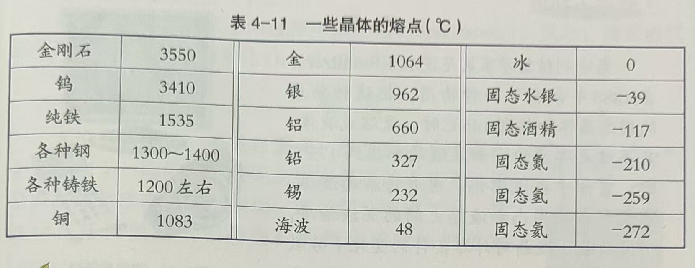

## 物质的构成（7上）

三态：固态、液态、气态

### 分子

分子是构成物质的一种极其微小的粒子。如一滴水中约有$1\times 10^{21}$ 个水分子。

构成物质的分子之间存在着空隙。如水和酒精混合时，水分子和酒精分子彼此进入对方分子的空隙中，总体积减少。

- 固体分子的间距很小，且呈规则排列，分子在确定位置上不停振动。所以固体具有**稳固性**，有一定的体积和形状。
- 液体分子的间距通常比固体略大，呈不规则排列，分子不断振动并做短距离的自由移动。所以液体具有**流动性**，它有一定的体积，但没有一定的形状。
- 气体分子的间距很大，呈不规则排列。分子可以在空间到处自由运动。所以气体具有**弥散性**，能充满所能到达的空间。它既没有一定的体积也没有一定的形状。

构成物质的分子都在不停地做无规则运动，温度越高，分子无规则运动越剧烈。因为和温度有关，所以把分子永不停歇的无规则运动叫做**热运动**。

构成物质的分子之间虽然彼此相互隔开，却存在着相互作用的**引力**，将分子与分子聚集在一起，构成各种固体和液体。不但物体内部的分子之间存在引力，两个物体接触面上的分子之间同样存在着相互作用的引力。

物质内部的分子之间也存在**斥力**，使物体内部的分子很难靠的很近。

### 质量

物体含有物质的多少用质量表示，常用单位：吨、千克、克、毫克

质量是物体的属性，它不随物体的位置、形状、温度和状态等的改变而改变。

### 密度

单位体积的某种物质的质量，叫做这种物质的密度。其定义式为：$密度=\frac{质量}{体积}$

用符号$\rho $ 表示密度，m 表示质量，V 表示体积，则密度公式为：$\rho = \frac{m}{V}$

### 比热

温度不同的两个物体之间发生热传递时，热会从温度高的物体传向温度低的物体。

物体吸收或放出热的多少叫做热量，用符号Q 表示。热量的单位为焦耳，简称焦，符号为 J

质量相同的不同物质，升高（降低）相同温度，吸收（放出）的热量也不同。物质的这种特性在科学上叫做**比热容**，简称比热。

质量相同的不同物质，升高（降低）相同的温度，吸收（放出）的热量较多的，比热较大。... 较小。

例如水的比热容较大，用来恒温（发动机散热、夜间稻田保温）

### 三态转化

物质从固态变成液态的过程叫做**熔化**；从液态变成固态的过程叫做**凝固**。

物质由液态变成气态的过程叫做**汽化**；由气态变为液态的过程叫做**液化**。

物质从固态直接变成气态的过程叫做**升华**；从气态直接变成固态的过程叫做**凝华**。

夜间水蒸气会液化成露；足够寒冷的话水蒸气会凝华成霜。

#### 熔化

海波的熔化是在一定的温度下进行的，在这一温度下会出现固、液共存的状态。

松香在熔化时，温度则持续上升，它是一个逐渐变软再变稀的过程。

- 一类像海波那样，在熔化时具有一定的熔化温度，这类固体叫做**晶体**；

  晶体熔化时的温度叫做**熔点**。

  

- 另一类像松香那样，再熔化时没有一定的熔化温度，这类固体叫做非晶体。

但是无论是晶体还是非晶体，熔化时都要从外界吸收热量。

#### 凝固

凝固时熔化的逆过程。无论是晶体还是非晶体，在凝固时都要向外放热。

液态晶体在凝固过程中温度保持不变，这个温度叫做晶体的凝固点。同一晶体的凝固点与熔点相同。

#### 汽化

液体汽化时，温度要降低。它会从周围的物体吸收热量，从而导致周围的物体温度降低。

在任何温度下都能进行的汽化现象叫做**蒸发**。以分子运动的观点看，组成液体的大量分子总在不停地运动着，其中有些分子运动的速度较大。当这些分子处于液体表面时，就容易克服其他分子对它的引力，离开页面进入空气中。

> 那是否可以理解为空气分子和表面的引力导致？

液体表面积越大、温度越高、液体表面空气流动越快，液体蒸发就越快。

**沸腾**是在一定的温度下，在液体的表面和内部同时进行的剧烈的汽化现象。以分子运动的观点看，液体沸腾时，不但处于液面速度较大的分子要脱离液体表面跑到空气中，处于液体内部气泡壁上速度较大的分子也要脱离气泡壁跑到气泡中。

> 水在一定的温度下会发生沸腾，一方面水面的蒸发十分急剧，另一方面水内部形成大量的气泡，气泡内充满了水蒸气。

液体沸腾时的温度叫做**沸点**。

#### 液化

所有气体在**温度降低到足够低**时，都会发生液化成为液体。在一定的温度下，用**压缩体积**的方法也可以使气体液化。

与液体的汽化相反，气体液化时要放出热量。 

#### 升华凝华

用分子运动的观点看，升华是固态物质表面的分子克服其他分子对它的引力进入空气中的过程，而凝华则是气体分子碰到固态物质的表面，并被固态物质分子的引力所束缚的过程。

升华时吸收热量，凝华时放出热量。

### 物理化学

如果物质只发生颜色、状态等变化，而没有产生新的物质，这种变化叫做**物理变化**。三态转化，属于物理变化。

如果物质在发生变化后有新的物质产生，这种变化叫做**化学变化**。铁生锈、氢氧化钠和氯化铁的反应，都属于化学变化。化学变化中通常都伴随着物理变化。

物理性质：颜色、状态、气味、熔点、沸点、硬度、延展性、导热性、导电性等。是不需要发生化学变化就能表现出来的。

还有些在化学变化中才能表现出来的，叫做化学性质。