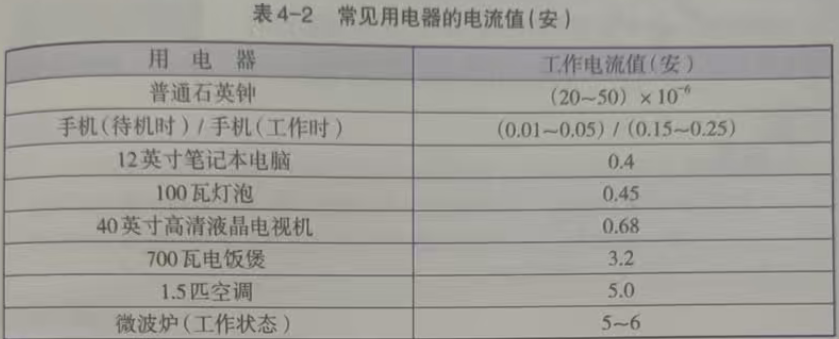
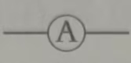
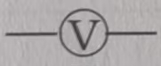
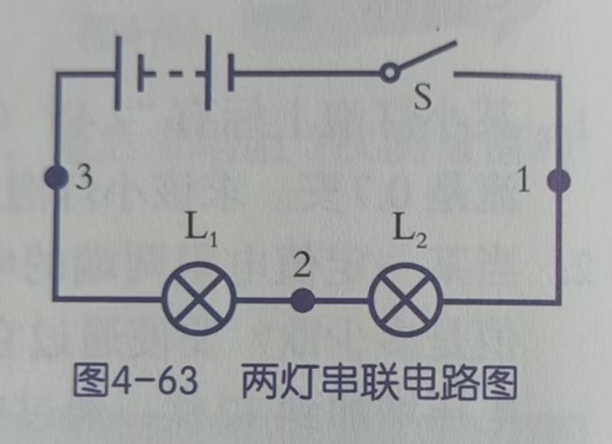
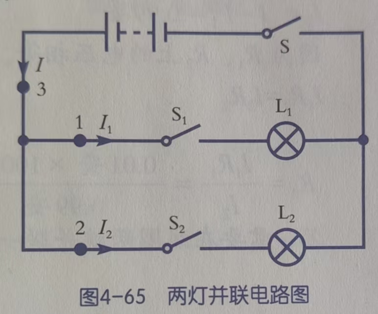

## 测量（8上）

### 电流

导体中电流的大小称为**电流强度**，简称电流。电流是指单位时间内通过导线某一截面的电荷的多少，用字母 I 表示。单位是安培，简称安，符号为 A

不同的用电器工作电流是不同的。

**电流表**的符号是：

### 电压

要使电流持续，需要一种动力，即电源提供的**电压**。用字母U 表示，单位是伏特，简称伏，符号为V。测量电压的仪表是电压表，符号是：

### 电压电流电阻关系

$I = \frac{U}{R}$

### 简单电路

有$I_1 = I_2 = I_3 = I; U_总 = U_1 + U_2$

有$I = I_1 + I_2; U_1 = U_2 = U$

串联电路中电流处处相等；并联电路中干路电流等于各支路电流之和。

串联电路的电压逐级消耗；并联电路的支路两端电压与干路电压相等

所以如果电路中并联的用电器越多，电源的输出电流会越大。可能损坏电源或者导线过热发生火灾。