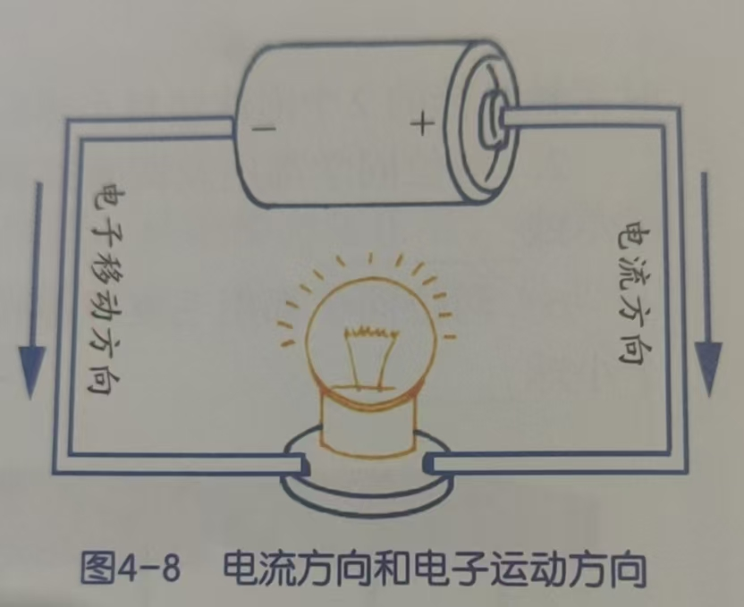
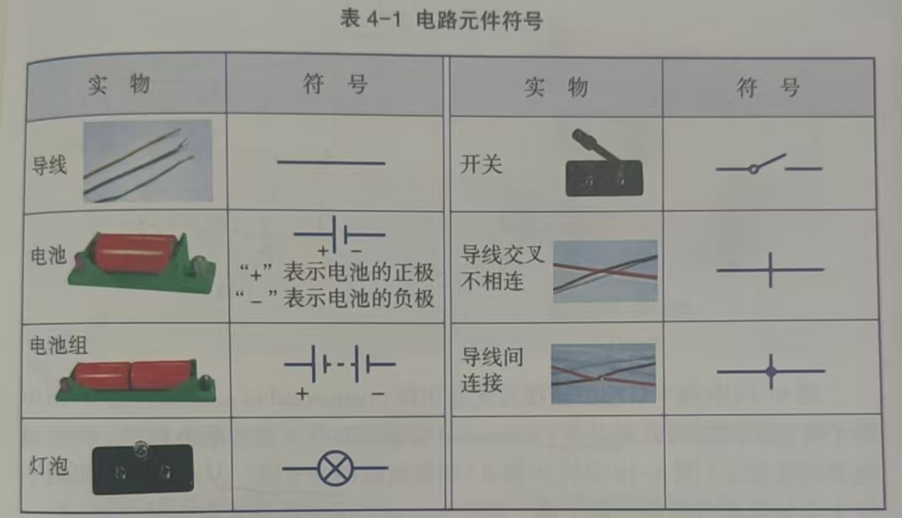
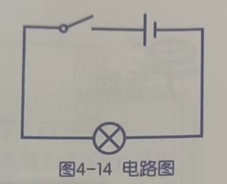
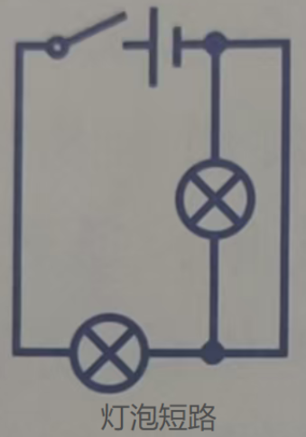
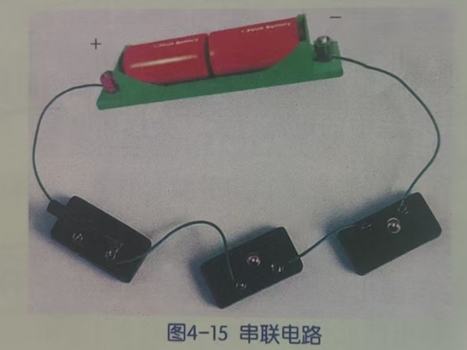
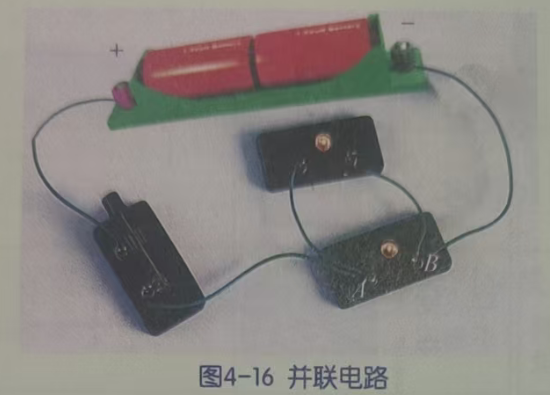
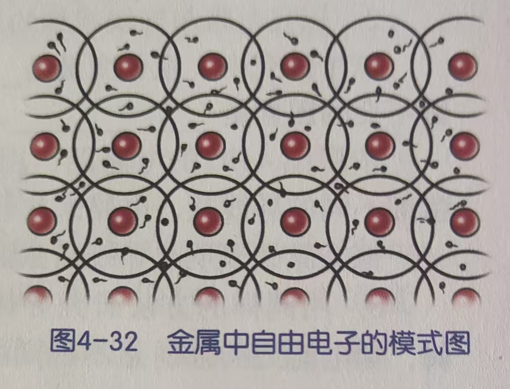
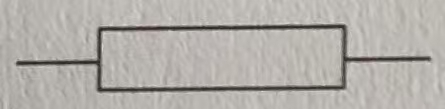
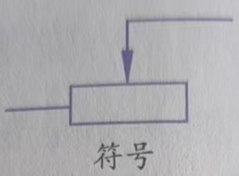

## 电

### 电荷（8上）

物体内有两种不同的带电粒子，一种是**质子**，带正电；另一种是**电子**，带负电。（统称为**电荷**）。通常情况下带正电的质子的数量与带负电的电子的数量相等，正负电荷能相互抵消，整个物体没有呈现带电性。

物体之间的摩擦会使一个物体上的电子转移到另一个物体上，得到电子的那个物体就带负电，另一个失去电子的物体就带等量的正电，这种现象称为**摩擦起电**。这些物体所带的电荷叫做**静电**（没有形成定向移动的电流）。

同种电荷相互排斥，异种电荷相互吸引。

### 电流（8上）

像发电机、电池一样能提供电能的装置，叫做**电源**。接入电路的电源，能使导体内部的电荷产生定向运动，形成持续不断的电流。

金属导体中的电流是由带负电的电子的定向移动形成的，电子由电源的负极流出，流向电源的正极。其反方向为科学上规定的电流方向。

### 电路（8上）

把电源、用电器和开关用导线连接起来组成的电流路径叫做**电路**。

用元件符号代替实物表示电路的图称为**电路图**。

开关闭合时，电路中会有电流，叫做**通路**；开关断开，或电路中某一部分断开时，电路中不再有电流，叫做**开路**。如果不经过电器，直接用导线将电源两极连接起来，叫做电源**短路**（短路时电流过大， 会损坏电源，甚至发生火灾）。

4-15中两个灯泡的连接方式是**串联**；4-16中两个灯泡的连接方式是**并联**。在并联电路里，并联用电路的连接点（4-16中的A和B）叫做电路的**分支点**，从电源两极到两个分支点的那部分电路叫做**干路**，两个分支点之间的两条电路叫做**支路**。

### 导电性（8上）

容易导电的物质叫做**导体**。金属、石墨（碳）、人体、大地、盐类的水溶液等

不容易导电的物质叫做**绝缘体**。橡胶、玻璃、瓷、塑料、干木材、油和干燥的空气等

纯净的水是不导电的，但由于自然界的水中溶有大量其他物质，因此生活用水一般导电。

导体和绝缘体并不是绝对的，有些绝缘体在条件改变时会变成导体（如烧红）。导体的表面被氧化或腐蚀后，到点能力会下降，甚至不导电。

导电能力介于导体与绝缘体之间的一类物质叫做**半导体**。常见的材料是硅和锗。

金属内部原子核的位置是相对固定的，但存在着大量可自由移动的电子。

自由电子能从一个地方移动到另一个地方，所以金属能导电。

而在绝缘体中，几乎没有能自由移动的电子，因此不能导电。

为了描述物体导电能力的强弱，我们引入**电阻**的概念。电阻表示导体对电流的阻碍作用。导体对电流的阻碍能力越强，其电阻值就越大。

绝缘体的电阻非常大，电流不容易通过；导体的电阻非常小，电流很容易通过。

电阻用字母R 表示，单位是欧姆，简称欧，符号是$\Omega$。

用同种材料的导线，导线越长，电阻越长；导线越细，电阻也越大。

金属导体的电阻会随温度的升高而增大；某些材料的温度降低到一定程度时，电阻会突然消失，即**超导**现象。

常用到具有一定阻值的元件，即电阻器，也简称为电阻。符号是：

也常常要使用可以改变电阻值的电阻器，即变阻器。常用变阻器通过改变接入电路的电阻丝有效长度来改变电阻大小，可以通过滑动实现。所以叫做**滑动变阻器**，符号是：

还有敏感电阻：如光敏电阻器在光照下，其阻值会迅速减小，因此可用于光的测量、控制或光电转换。

