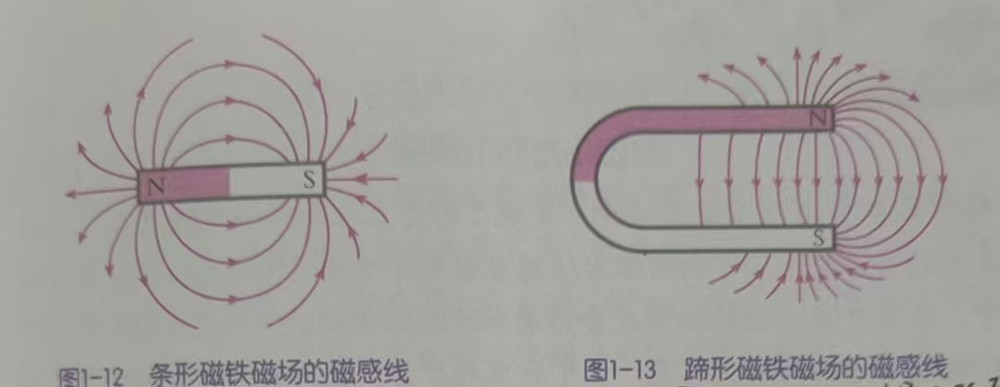

## 磁(8上)

**磁体**具有吸引铁、钴、镍等物质的性质，这种性质叫做**磁性**。

磁体上磁性最强的部位叫做**磁极**。条形磁体的两端吸住铁屑最多，所以其两端就是它的两个磁极。如果磁体能自由转动（如用针尖支撑的小磁针），静止时两端总是指向南北方向。把磁体指北的那个磁极叫做**北极**（N极）；指南的那个磁极叫做**南极**（S极）。任何磁体都有两个磁极。

两块条形磁体彼此之间会产生吸引或排斥的力，这种力就是**磁力**。磁体间的相互作用规律：同名磁极相互排斥，异名磁极相互吸引。

日常所用的磁体一般都是人造的，具体通过磁化来实现：

当条形磁体靠近铁棒时，铁棒就具有了吸引大头针的能力，说明磁体使铁棒获得了磁性。这种使原来没有磁性的物体得到磁性的过程叫做**磁化**。

铁棒不能长久保持磁性；而钢棒可以较长久的保持磁性，用来制造永磁体。

磁体的周围存在**磁场**。处在磁场的小磁针，会受到磁力的作用而改变指向。科学上把小磁针静止时北极所指的方向规定为其所处位置的**磁场方向**。

为了形象的描述磁体周围的磁场分布，用**磁感线**模型。

磁感线上的箭头表示的方向，即磁场方向。磁体周围的磁感线总是从磁体的北极出来，回到磁体的南极。磁感线密的地方磁场强，疏的地方磁场弱。

地球是一个大磁体，其产生的磁场叫**地磁场**。

