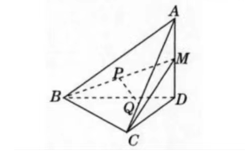

## 立体基础-课内

#### 基本事实

- 不共面的四点可以确定几个平面？请画出图形说明你的结论
- 三个平面可以将空间分成几个部分？请分情况说明
- 四边形是否可以确定一个平面？

> 最多4（3棱锥；最多7；可

#### 点与面

- 过$\triangle ABC$ 所在平面$\alpha$ 外一点P，做$PO\perp\alpha$，垂足为O，连接PA，PB，PC

    （1）若PA=PB=PC，则点O 是$\triangle ABC$ 的`____` 心

    （2）若PA=PB=PC，$\angle C=90^\circ$，则点O 是AB 边的`____` 心

    （3）若$PA\perp PB,PB\perp PC,PC\perp PA$，垂足都为P，则点O 是$\triangle ABC$ 的`____` 心

> 外、中、垂

#### 面与角

- 已知正方体ABCD-A'B'C'D'，求直线BA‘ 与AC 所成的角的大小

> $60^\circ$

#### 线与面

- 设直线a，b 分别是长方体的相邻两个面的对角线所在的直线，则a 与b是什么位置关系
- 已知直线a，b，平面$\alpha,\beta$，且$a\subset \alpha,b\subset\beta,\alpha//\beta$。判断直线a，b 的位置关系，并说明理由

> 相交或异面；只能确定不相交？

- 已知$\alpha,\beta$ 是两个不同的平面，m 为平面$\alpha$ 内的一条直线，则$\alpha\bot \beta$ 是$m\bot \beta$ 的：  B

  A. 充分不必要条件。  B. 必要不充分条件.   C. 充要条件。  D. 既不充分也不必要条件

- 如图是一个正方体的展开图，

  

  如果将它还原为正方体，那么在AB，CD，EF，GH 这四条线段中，哪些线段所在直线是异面直线？

> AB 与GH，AB与CD，EF与GH

#### 定理

- 判断：平面$\alpha$ 与平面$\beta$ 平行的充分条件是“$\alpha$ 内有无穷多条直线都与$\beta$ 平行”

> 正确

- 如图，$AA',BB',CC'$ 不共面，且$AA'\underset{=}//BB',BB'\underset{=}//CC'$，

  

  求证：$\triangle ABC \cong \triangle A'B'C'$

- 如下图，四边形A'B'C'D' 是平行四边形ABCD 在平面$\alpha$上的投影（AA'//BB'//CC'//DD'），

  

  求证：四边形A'B'C'D' 是平行四边形

- 【回顾】如图，$\alpha//\beta//\gamma$，直线a 与b 分别交$\alpha,\beta,\gamma$ 于点A，B，C 和点D，E，F

  

  求证$\frac{AB}{BC}=\frac{DE}{EF}$

  > 注意AC，DF 不一定共面。取AD 中点，然后平行AC，DF 画出一个三角形

- 已知m，n 为异面直线，m$\bot$ 平面$\alpha$ , n$\bot$ 平面$\beta$ 。若直线$l$ 满足$l \bot m,l \bot n, l\subsetneqq \alpha, l \subsetneqq \beta$ 则：

  A. $\alpha // \beta, l // \alpha$    B. $\alpha, \beta$ 相交且交线平行于$l$    C. $\alpha \bot \beta, l \bot \beta$    D. $\alpha,\beta$ 相交且交线垂直于$l$ 

> B

- 【线面】在正方体ABCD-A'B'C'D' 中，E 为$DD_1$ 的中点，判断$BD_1$ 与平面AEC 的位置关系，并说明理由。

> 平行（AC 中点F，线EF 平行于$BD_1$

- 如图，在正三棱柱ABC-A'B'C' 中，D 为棱AC 的中点

  

  求证 $BD\perp AC'$ 

  > 易证BD 垂直于平面ACC'

- 如图，在正方体$ABCD-A_1B_1C_1D_1$ 中，$O_1$ 为底面$A_1B_1C_1D_1$ 的中心

  

  求证$AO_1\perp BD$

  > DB 中点为O，反向证明DB 垂直于平面$AOO_1$ 

- 【面面】如图，在正方体ABCD-A'B'C'D' 中，M，N，E，F 分别是棱$A_1B_1,A_1D_1,B_1C_1,C_1D_1$ 的中点

  

  求证：平面AMN// 平面DBEF

> MA//FD，NM//FE。且各自有交点。

- 如图，在四棱锥P-ABCD 中，底面ABCD 为正方形，$PA\bot 底面ABCD$ ，PA=AB，E 为线段PB 的中点，F 为线段BC 上的动点，平面AEF 与平面PBC 是否互相垂直？

  

  如果垂直，请证明；如果不垂直，请说明理由

  > 易证BC 垂直于面PAB，所以BC 垂直于AE，做PC 中点G，则AE 垂直于EG，又AE 垂直于PB，所以AE 垂直于PBC

- 如图，在四面体A-BCD 中，AD$\perp$ 平面BCD，M 是AD 的中点，P 是BM 的中点，点Q 在线段AC 上，且AQ=3QC，求证：PQ // 平面BCD

  

  > MD 中点E，易证PE 平行于BD，QE 平行于CD，所以面PQE // 面BCD，所以PQ // 面BCD

- 如图，在正方形$ABCD-A_1B_1C_1D_1$ 中，求证：

  

  （1）$B_1D\bot$ 平面$A_1BC_1$

  （2）$B_1D$ 与平面$A_1BC_1$ 的交点H 是$\triangle A_1C_1B$ 的重心

> $BA_1 \perp AD,BA_1\perp A_1B,所以BA_1\perp ADB_1，所以A_1B\perp DB_1，同理A_1C_1\perp DB_1$；
>
> $A_1C_1中点E，易得A_1C_1\perp EB_1,B_1H\perp A_1C_1,所以A_1C_1\perp B_1EH,所以A_1C_1\perp HE$ 同理为三条高

- 【线面角】如图，在三棱锥P-ABC 中，$\angle ACB=90^\circ$，PA$\bot$ 底面ABC

  

  （1）求证：平面PAC$\bot$ 平面PBC

  （2）若AC=BC=PA，M 是PB 的中点，求AM 与平面PBC 所成角的正切值

  > BC 垂直于PAC；
  >
  > $\sqrt{2}$（PC 中点E，BC 垂直于AE，AE 垂直于PC，所以AE 为垂线，线面角为AME，结果为AE/EM