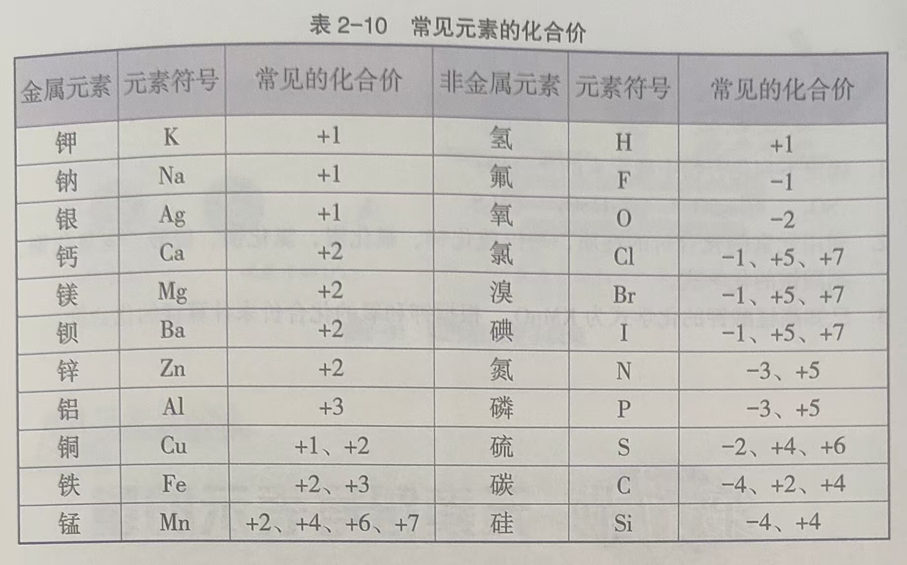
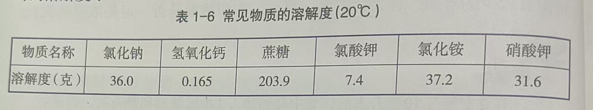

## 物质的构成

三态：固态、液态、气态

### 分子（7上）

分子是构成物质的一种极其微小的粒子。如一滴水中约有$1\times 10^{21}$ 个水分子。

构成物质的分子之间存在着空隙。如水和酒精混合时，水分子和酒精分子彼此进入对方分子的空隙中，总体积减少。

- 固体分子的间距很小，且呈规则排列，分子在确定位置上不停振动。所以固体具有**稳固性**，有一定的体积和形状。
- 液体分子的间距通常比固体略大，呈不规则排列，分子不断振动并做短距离的自由移动。所以液体具有**流动性**，它有一定的体积，但没有一定的形状。
- 气体分子的间距很大，呈不规则排列。分子可以在空间到处自由运动。所以气体具有**弥散性**，能充满所能到达的空间。它既没有一定的体积也没有一定的形状。

构成物质的分子都在不停地做无规则运动，温度越高，分子无规则运动越剧烈。因为和温度有关，所以把分子永不停歇的无规则运动叫做**热运动**。

构成物质的分子之间虽然彼此相互隔开，却存在着相互作用的**引力**，将分子与分子聚集在一起，构成各种固体和液体。不但物体内部的分子之间存在引力，两个物体接触面上的分子之间同样存在着相互作用的引力。

物质内部的分子之间也存在**斥力**，使物体内部的分子很难靠的很近。

### 原子（8上）

水分子中含有两种不同的、更小的粒子，这种粒子就是**原子**。

分子是由原子构成，原子又由**原子核**和**绕核高速运动的电子**构成的。电子带负电，原子核带正电。

（8下）

构成分子的原子可以是同种原子（如氢分子-两个氢原子），也可以是不同种原子。

物质通常是由分子构成的（如水-水分子），但也有些物质是直接由原子构成的（如石墨-碳原子）。

原子核在原子中所占的体积极小，但是几乎集中了原子的全部质量。

原子核有两种更小的粒子：**质子和中子**构成。一个质子带一个单位正电荷，中子不带电。原子核所带的电荷数称为核电荷数。

质子和中子都是由更小的基本粒子--**夸克**构成的（夸克还可以再分）。

（必修3）

金属中原子的外层电子往往会脱离原子核的束缚而在金属中自由运动，这种电子叫做**自由电子**。

失去自由电子的原子便成为带正电的**离子**。

它们在金属内部排列起来，每个正离子都在自己的平衡位置附近振动而不移动，只有自由电子穿梭其中，这就使金属成为导体。

### 离子（8下）

金属钠在氯气中燃烧时，钠原子失去了电子形成带正电荷的钠离子（阳离子），绿原子得到了电子形成带负电荷的氯离子（阴离子）。带有相反电荷的钠离子和氯离子之间相互吸引，构成了电中性的氯化钠。

因此，与分子、原子一样，**离子**也是构成物质的基本粒子。

物质溶解于水或受热熔化而形成自由移动离子的过程，叫做**电离**。

### 元素（8下）

一种原子的原子核内质子数是一定的，核电荷数也是一定的。例如，一种氧原子的原子核内有8个质子和8个中子，核电荷数为8；另一种氧原子的原子核内有8个质子和9个中子，其核电荷数也为8。科学上把具有相同核电荷数（即质子数）的一类原子总称为**元素**，如氧元素就是所有核电荷数为8 的原子的总称。

原子核内的质子数相同、中子数不相同的同类原子互为**同位素**原子。

由同种元素组成的纯净物称为**单质**（如氧气、金属铁）；由不同种元素组成的纯净物称为**化合物**（如二氧化碳、水）。

人们通常把元素分为**金属元素**和非金属元素。

性质非常稳定，在通常情况下很难与其他元素或物质发生化学反应，在自然界中的含量稀少，这类气体叫做**稀有气体**（如氩气）。对应元素属于稀有元素。稀有气体元素也属于非金属元素。

#### 元素符号

元素符号一般表示：一种元素；这种元素的1个原子。

**元素周期表**：共有7个横行，18个纵列。每一个横行叫做一个周期，每一个纵列叫做一个族（8、9、10三个纵列共同组成一个族）。每一种元素在元素周期表中都占有一个位置。

### 化学式（8下）

用元素符号来表示物质组成的式子称为**化学式**（如二氧化碳 - $CO_2$）。一种物质只有一个化学式。

离子符号：如$Na^+, S^{2-}$。有些离子的组成不止一种元素，如$SO^{2-}_4$ ，像这种由2 种以上元素原子组成的离子称为某某**根离子**（如$SO_4^{2-}$是$H_2SO_4$ 这种酸的酸根离子），是带电**原子团**。（在许多化学反应里，参加反应的原子集团叫做原子团） 

不同原子构成分子时，各种原子的个数依据“**化合价**”来得出。如氢（H）的化合价为+1，氧（O）的为-2，氢或氧与其他元素组成化合物时，其遵守的规则是化合物中所有元素化合价的代数和为零。

很容易得出氧化钠的化学式是：$Na_2O$

### 质量（7上）

物体含有物质的多少用质量表示，常用单位：吨、千克、克、毫克

质量是物体的属性，它不随物体的位置、形状、温度和状态等的改变而改变。

### 密度（7上）

单位体积的某种物质的质量，叫做这种物质的密度。其定义式为：$密度=\frac{质量}{体积}$

用符号$\rho $ 表示密度，m 表示质量，V 表示体积，则密度公式为：$\rho = \frac{m}{V}$

### 比热（7上）

温度不同的两个物体之间发生热传递时，热会从温度高的物体传向温度低的物体。

物体吸收或放出热的多少叫做热量，用符号Q 表示。热量的单位为焦耳，简称焦，符号为 J

质量相同的不同物质，升高（降低）相同温度，吸收（放出）的热量也不同。物质的这种特性在科学上叫做**比热容**，简称比热。

质量相同的不同物质，升高（降低）相同的温度，吸收（放出）的热量较多的，比热较大。... 较小。

例如水的比热容较大，用来恒温（发动机散热、夜间稻田保温）

### 三态转化（7上）

物质从固态变成液态的过程叫做**熔化**；从液态变成固态的过程叫做**凝固**。

物质由液态变成气态的过程叫做**汽化**；由气态变为液态的过程叫做**液化**。

物质从固态直接变成气态的过程叫做**升华**；从气态直接变成固态的过程叫做**凝华**。

夜间水蒸气会液化成露；足够寒冷的话水蒸气会凝华成霜。

#### 熔化

海波的熔化是在一定的温度下进行的，在这一温度下会出现固、液共存的状态。

松香在熔化时，温度则持续上升，它是一个逐渐变软再变稀的过程。

- 一类像海波那样，在熔化时具有一定的熔化温度，这类固体叫做**晶体**；

  晶体熔化时的温度叫做**熔点**。

  

- 另一类像松香那样，再熔化时没有一定的熔化温度，这类固体叫做非晶体。

但是无论是晶体还是非晶体，熔化时都要从外界吸收热量。

#### 凝固

凝固时熔化的逆过程。无论是晶体还是非晶体，在凝固时都要向外放热。

液态晶体在凝固过程中温度保持不变，这个温度叫做晶体的凝固点。同一晶体的凝固点与熔点相同。

#### 汽化

液体汽化时，温度要降低。它会从周围的物体吸收热量，从而导致周围的物体温度降低。

在任何温度下都能进行的汽化现象叫做**蒸发**。以分子运动的观点看，组成液体的大量分子总在不停地运动着，其中有些分子运动的速度较大。当这些分子处于液体表面时，就容易克服其他分子对它的引力，离开页面进入空气中。

> 那是否可以理解为空气分子和表面的引力导致？

液体表面积越大、温度越高、液体表面空气流动越快，液体蒸发就越快。

**沸腾**是在一定的温度下，在液体的表面和内部同时进行的剧烈的汽化现象。以分子运动的观点看，液体沸腾时，不但处于液面速度较大的分子要脱离液体表面跑到空气中，处于液体内部气泡壁上速度较大的分子也要脱离气泡壁跑到气泡中。

> 水在一定的温度下会发生沸腾，一方面水面的蒸发十分急剧，另一方面水内部形成大量的气泡，气泡内充满了水蒸气。

液体沸腾时的温度叫做**沸点**。

#### 液化

所有气体在**温度降低到足够低**时，都会发生液化成为液体。在一定的温度下，用**压缩体积**的方法也可以使气体液化。

与液体的汽化相反，气体液化时要放出热量。 

#### 升华凝华

用分子运动的观点看，升华是固态物质表面的分子克服其他分子对它的引力进入空气中的过程，而凝华则是气体分子碰到固态物质的表面，并被固态物质分子的引力所束缚的过程。

升华时吸收热量，凝华时放出热量。

### 物理化学（7上）

如果物质只发生颜色、状态等变化，而没有产生新的物质，这种变化叫做**物理变化**。三态转化，属于物理变化。

如果物质在发生变化后有新的物质产生，这种变化叫做**化学变化**。铁生锈、氢氧化钠和氯化铁的反应，都属于化学变化。化学变化中通常都伴随着物理变化。

物理性质：颜色、状态、气味、熔点、沸点、硬度、延展性、导热性、导电性等。是不需要发生化学变化就能表现出来的。

还有些在化学变化中才能表现出来的，叫做化学性质。

### 溶解（8上）

被溶解的物质（如砂糖）称为**溶质**；能溶解其他物质的物质（如水）称为**溶剂**；溶解后得到的物质叫做**溶液**。溶质可以是任意三态。水是较好的溶剂，许多物质都能溶于水中，也有一些物质不能溶解在水中。

固体小颗粒悬浮在液体里而形成的物质叫做**悬浊液**；小液滴分散到液体里形成的物质叫做**乳浊液**

溶液、悬浊液、乳浊液中均含有多种物质，这种由多种物质组成的物质叫做**混合物**。悬浊液、乳浊液不稳定，静置一段时间后会分层，而溶液则是均一、稳定的混合物。

在一定温度下，一定量的溶剂中，如果溶剂不能继续溶解某种溶质的溶液，称为这种溶质的**饱和**溶液；还能继续溶解某种溶质，称为这种溶质的不饱和溶液。

在溶液的配制过程中，有的溶液熔有许多的溶质，称为浓溶液；有的溶液溶有较少的溶质，称为稀溶液。

饱和溶液不一定是浓溶液。

用**溶解度**来定量地表示物质的溶解性，即在一定的温度下，某物质在100克溶剂中达到饱和状态时所溶解的质量为该物质在这种溶剂力的溶解度。

$20^\circ C$ 时，溶解度在10克以上的物质，一般称为易溶物质；在1~10克的物质为可溶物质；0.01~1克为微溶物质；小于0.01克的物质为难溶物质。

大部分固体物质的溶解度随温度的升高而增大，个别固体物质的溶解度随温度的升高而减小。气体物质的溶解度随温度的升高而减小。

### 结晶（8上）

晶体一般具有明显的形状。

**结晶**是溶液中无法再溶解的固体溶质以晶体的形式从溶液中析出的过程。

> 结晶一定是晶体吗？其他固体呢

蒸发溶剂或者冷却热饱和溶液都可以获得晶体。

> 个别是不是加热冷饱和溶液

有些晶体放在空气里，会逐渐吸收空气里的水分而变潮湿，直到在它的表面上溶解而成为饱和溶液甚至稀溶液（如氯化钙），这种现象称为**潮解现象**。

把水加热至沸腾， 产生的水蒸气经冷却形成液态水的方法称为**蒸馏法**。用这种方法收集到的水就是蒸馏水。蒸馏水中杂质非常少，可以看成是由单一的物质组成的。这种由一种物质组成的物质，叫做**纯净物**。