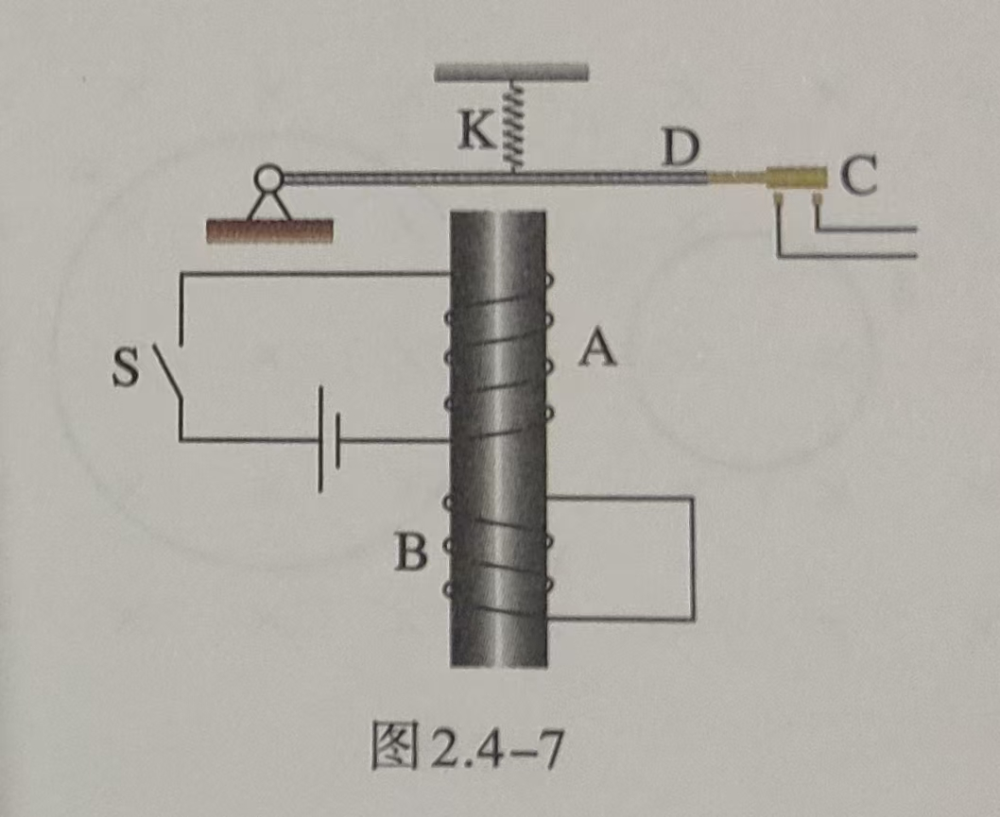
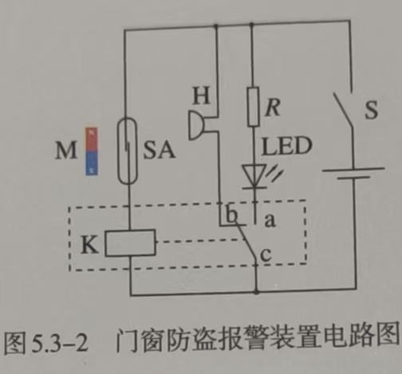
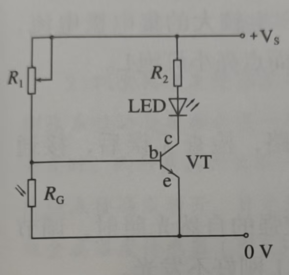
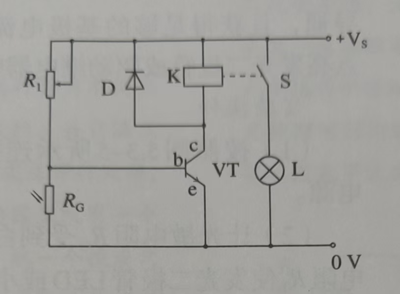

### 延时继电器

铁芯上有两个线圈A 和B。线圈A 跟电源连接；线圈B 两端连在一起。两个都是闭合电路。

在断开开关S 的时候，弹簧K 并不会立刻将衔铁D 拉起而使触头C（连接工作电路）离开，而是过一小段时间后才执行这个动作。

### 门窗报警

继电器（虚线框部分）

R 为限流电阻

闭合电路开关S，系统处于防盗状态。

当门窗紧闭时，磁体M 靠近干簧管SA，干簧管的两个簧片被磁化相吸而接通继电器线圈K，使继电器工作。继电器的动触点c 与常开触点a 接通，发光二极管LED 发光，显示电路处于正常工作状态。

当门窗开启时，磁体离开干簧管，干簧管失磁断开，继电器被断电。继电器的动触点c 与常闭触点b 接通，蜂鸣器H 发生报警。

此时干簧管在电路中起传感器和控制开关的作用，继电器则相当于一个自动的双向开关。

### 光控开关

用发光二极管模仿路灯。$R_2$ 为发光二极管的限流电阻。

可调电阻$R_1$ 与光敏电阻$R_G$ 组成串联分压电路，把光敏电阻因光照而发生的电阻变化，转换为电压的变化，加载到三极管VT 的基极b 上。当基极电压达到一定程度后，三极管被导通，从而使得电源正极 -- $R_2$ -- 发光二极管 -- 三极管集电极 -- 发射极 -- 电源负极 的回路被导通。

为了能驱动更大功率的负载，如采用小灯泡模拟路灯，就要使用继电器来启动、关闭另外的供电电路。

s 为继电器常开触点，为了防止继电器释放时线圈中的自感电动势损坏三极管，必须给线圈并联一只二极管D，以提供自感电流释放的通路。

当环境光比较强时，光敏电阻值很小，三极管不导通，发光二极管或继电器所在的回路相当于断路，即发光二极管不工作；继电器处于常开状态，小灯泡L 不亮。

当环境光较弱时，光敏电阻值变大，三极管导通，且获得足够的基极电流，产生较大的集电极电流，点亮发光二极管（图1）或驱动继电器吸合后点亮小灯泡L（图2）