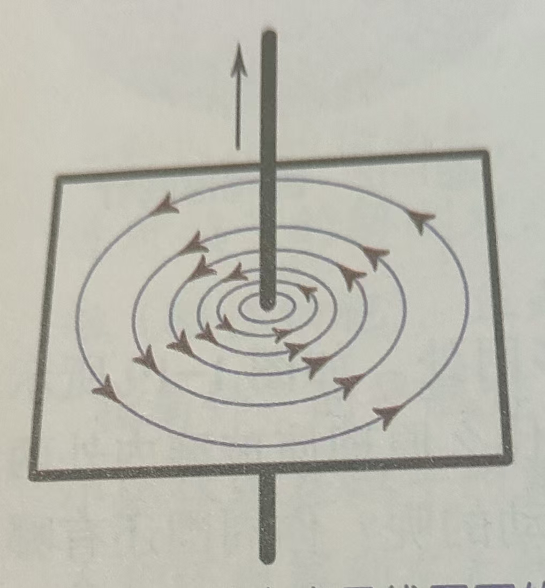
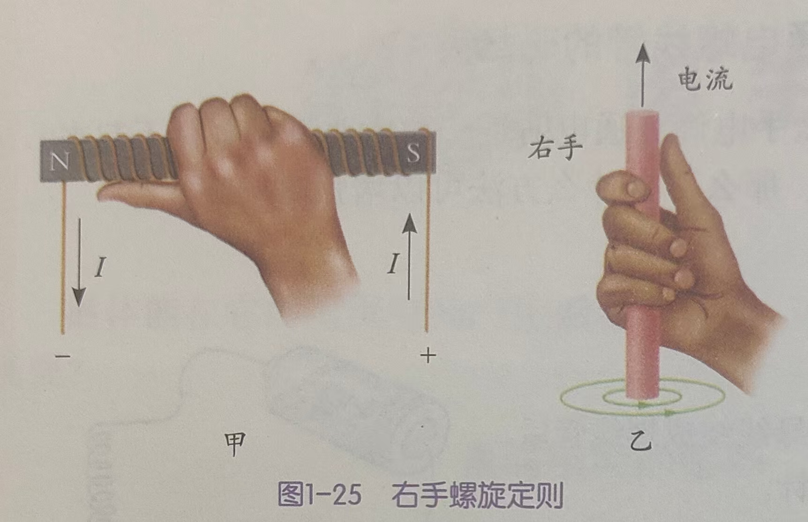
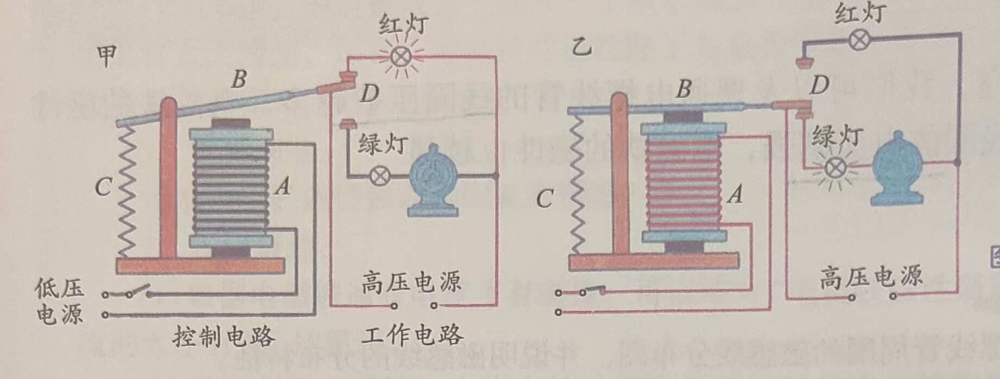
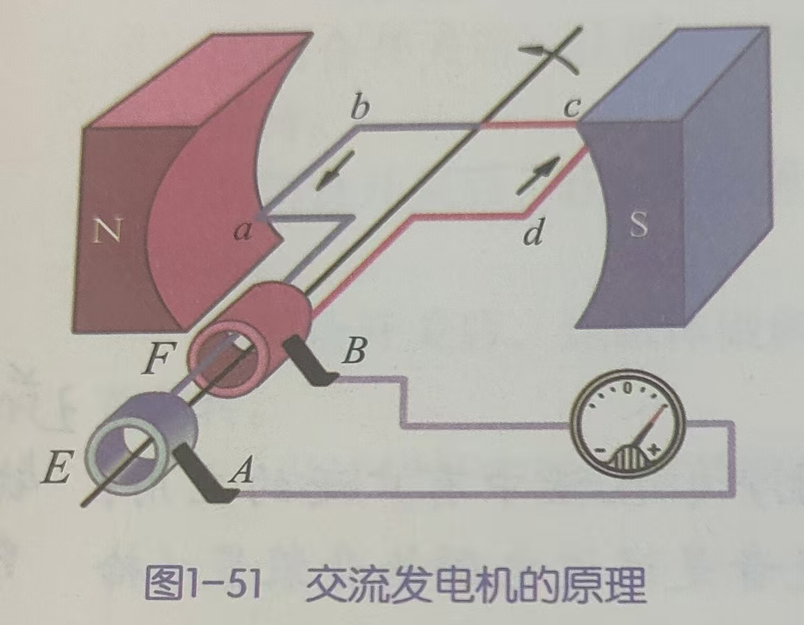
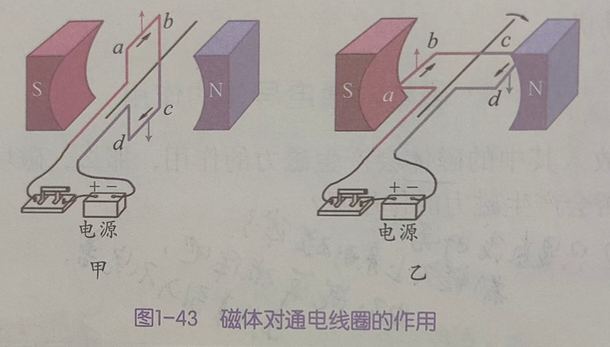
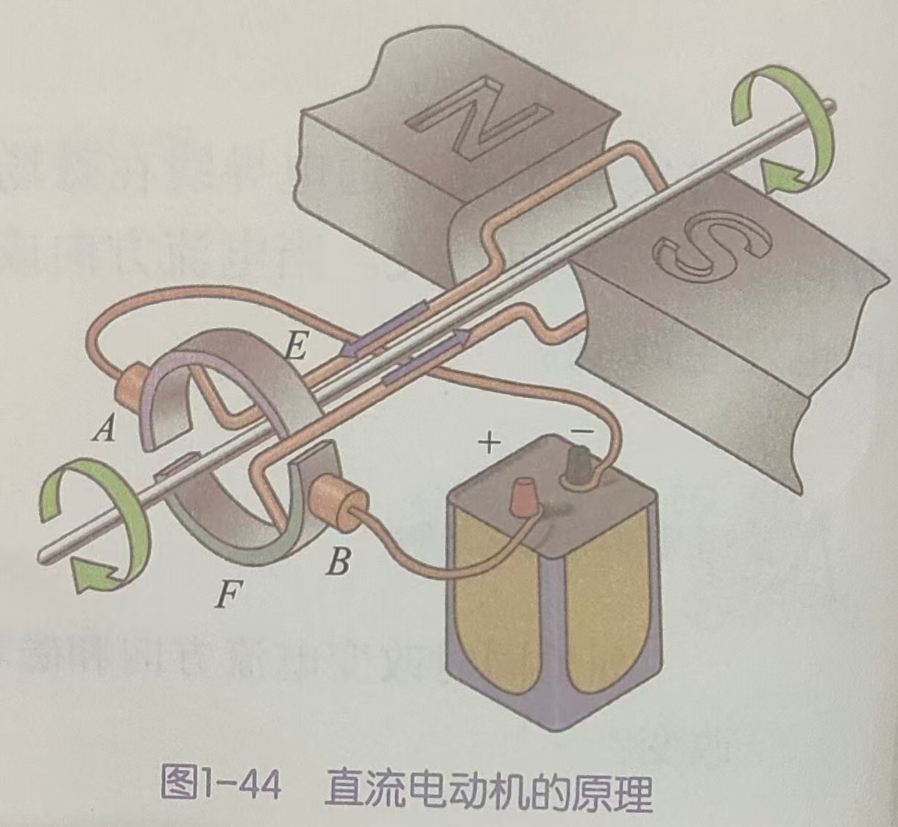
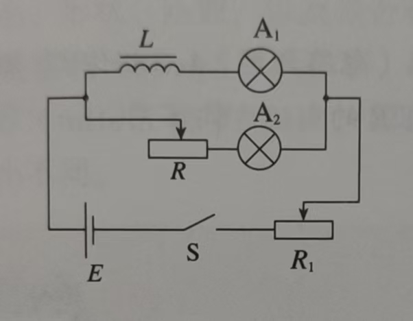

## 电磁

### 电生磁

通电导线的周围和磁体周围一样也存在磁场。

- 直线电流磁场的磁感线，是环绕导线的同心圆，距离直线电流越近，磁场越强，反之越弱。其产生的磁场方向和电流方向有关。

  

- 通电螺线管周围的磁场分布与条形磁体的磁场很相似。改变电流方向，其磁极会发生改变。

  带铁芯的通电螺线管叫做**电磁铁**。通电螺线管产生的磁场会将铁芯磁化，被磁化的铁芯磁场与之叠加，产生了更强的磁场。

  > 是不是可以放入一个两极相反磁体，消磁？

**右手螺旋定则**（也叫安培定则）：

- 用右手握螺线管，让四指弯向螺线管中的电流方向，大拇指所指的那一端就是通电螺线管的北极。
- 右手螺旋定则用来判断直线电流的磁场方向时，让大拇指指向电流方向，四指弯曲的方向就是直线电流产生的磁场方向。

通电螺线管的线圈**匝数越多**，电磁铁的磁性越强；通过线圈的电流越强，电磁铁的磁性也越强。

#### 电磁继电器  

电磁继电器主要由电磁铁A、衔铁B、弹簧C 和动触点D 组成。

当低压电源的开关闭合时，控制电路中有电流通过，电磁铁A 产生磁性，吸引衔铁B，使动触点与红灯触点分离，而与绿灯触点接通，故红灯熄灭，绿灯亮起，电动机开始工作。

当低压电源的开关断开时，电磁铁失去了磁性，衔铁B 在弹簧C 的作用下被拉起，使动触点与绿灯触点分离，而与红灯触点接通，故红灯亮起，绿灯熄灭，电动机停止工作。

### 磁生电

闭合电路的一部分导体在磁场中做切割磁感线的运动时，导体中就会产生电流，这种现象叫做**电磁感应**，产生的电流叫做**感应电流**。感应电流的方向跟导体的运动方向、磁场方向有关。如果电路不闭合，当导体做切割磁感线运动时，导体中不会产生感应电流，但在导体两端会有**感应电压**。

电磁感应现象中，移动导体切割磁感线时消耗了机械能，在闭合电路中产生了电能，这就实现了机械能向电能的转化。

#### 交流发电机

手摇发电机发出的是一种大小和方向都发生周期性变化的电流，这种电流叫**交流电**（AC）。交流电与由电池产生的电流是不同的，后者的电流方向是不变的，叫**直流电**（DC）。

> 右手：手心磁场方向，切割大拇指，四指电流方向

#### 通电线圈

通电导线在磁场中会受到力的作用，力的方向与电流方向及磁场方向有关。

线圈的ab 边受到向上的力，cd 边受到向下的力，两者大小相等。

如图甲，线圈受力平衡，处于**平衡位置**。

如图乙，线圈会沿顺时针方向转动，直至转过平衡位置，再沿逆时针转动，如此顺逆，最终返回平衡位置。

> 左手：手心磁场方向，四指电流方向，受力大拇指 
>

#### 直流电动机

电动机则加装了一个由两个铜制半环组成的“**换向器**”。转动部分（图中是线圈）叫做**转子**，固定部分（图中是磁体）叫做**定子**。A、B 是电刷，与电源相连，当线圈转动时，两个电刷交替着与半环E、F 相连，使通过线圈的电流方向发生变化，实现电动机的转子持续转动。

发电机和电动机的结构本质上是一样的，因此电动机也可以用来做发电机。（将电池换成机械转动源）

### 互感和自感（选必2）

两个线圈之间没有导线相连，但当一个线圈中的电流变化时，它所产生的变化的磁场会在另一个线圈中产生感应电动势。这种现象叫做**互感**，对应的互感电动势。

当一个线圈中的电流变化时，它所产生的变化的磁场在线圈本身激发出感应电动势，这种现象称为**自感**，对应自感电动势。

闭合开关的瞬间，电流从无到有，线圈L 中产生感应电动势。根据楞次定律，感应电动势会阻碍电流的增加，所以灯泡A1 较慢地亮起来。

