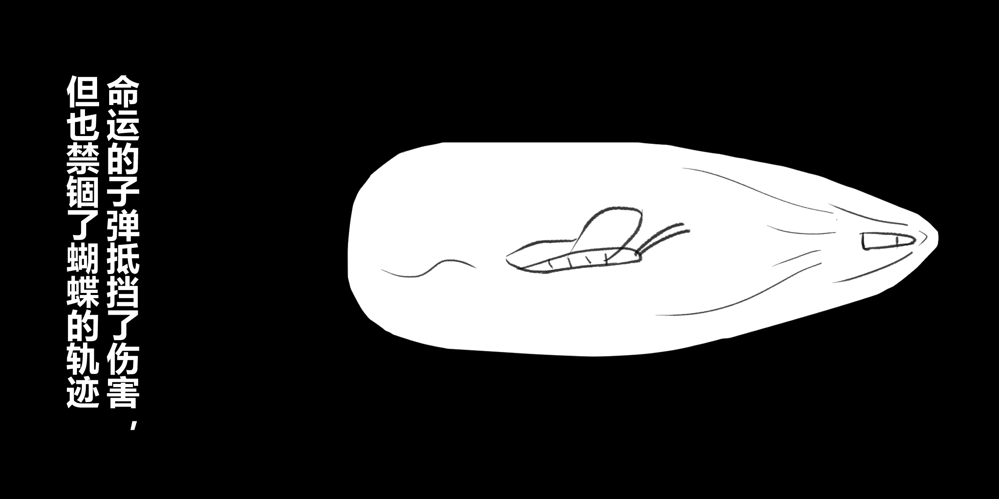
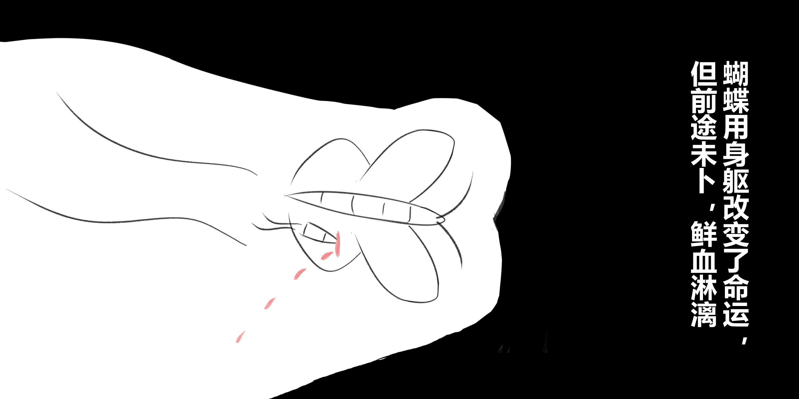
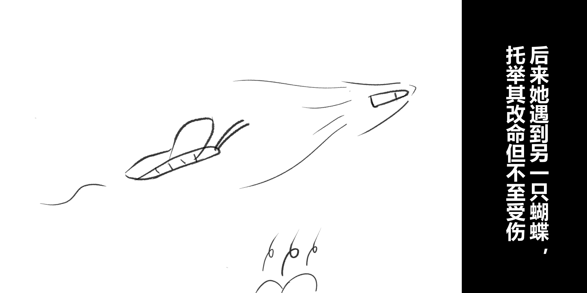

## 不争

我想了一下我妈的追悼墓志铭：

> 本不信神佛；但自你走后；遍地是妖魔。

初看《美丽人生》，我想这小孩回到家，该如何面对父母已经在游戏中死亡的真相。后来才发现：在生活中，没有人能认清真相。能有的，本就是片面的相信。

A 有天问我：你相信命运么？当时我没有正面回答，只是告诉她命运可以被改变。就像“蝴蝶效应”：当命运的子弹发出，蝴蝶可以扇出飓风，控制它的朝向。

后来我和A 表白，A 也没有给我正面回应。

尽管我们没结果的事实早已经确定，我还时常在想，如果当初我多扇一下翅膀，挣扎一下，是不是就会有不同结果。

我会想起那天之后，某次考试A 没有考好，回家休息了几天。这几天我在教室用粉笔和胶水做了粉笔球，并用练习纸折了包装盒，放在了她的桌子抽屉。她回来后却是一脸嫌弃，转身扔到了垃圾桶。

我在想如果那时候我可以有钱买更精致一点的东西，是不是就会有不同结果。

但是我为什么没有想自己去赚点钱呢？

我想如果要改变飓风，就得找到蝴蝶最开始扇翅膀的时候。

追根溯源，我回想到了小学的时候，和同学们一起去捡路边的铜丝铁丝卖，然后买零食。那会好像还有一些纯粹的欲望，那是什么时候我不再去想要得到呢？

可能是那天，B 想去街上吃两块钱的炒面，我妈同意了。我自然也想要两块钱，结果被我妈抄起柴火按在地上打。我想，这应该是物理上的欲望浇灭。

长大有和同学交流过类似的话题，他说他是被越打越勇。所以我想，更严重的应该还有精神浇灭。

那会十字会还没有那么多负面新闻，学校经常组织捐款。我妈是捐款积极分子，印象中二十、五十都给的很随意。她的本意应当是好的，想劝我向善，多帮助贫困的人。没想到的是，她因此被某老师给劝沉默了。他说我家仅陋室，却捐款较多。我当时理解这是一种夸赞，并深知自己为两块钱"狗滚地"的事情，觉得当之有愧，低下了头颅。老师以为我的低头是自卑，并告知了我妈。而后我妈很多事情就不再找我沟通，她相信了我很自卑。

奈何陋室，隔墙不隔音。我隐约听到很多关于我的事，却没人询问我的意见。我想参与，却没有人愿意讲与我听。我逐渐默然，慢慢习惯了置身事外。而置身事外的附带效果，就是少了和这个世界相关的欲望。

我失去了主动性。好像命运带我去哪里，我就飞去哪里，绝不挣扎。

住校的生活费是条目明确的。突然有一天，我妈不知道是为了试验什么，额外给了我五十块钱，并叮嘱这是一个月的零花钱。我大概一个星期就花了三十。然后她就说我没有经济规划的意识，再也没有给过我零花钱。我对此也自我反省了一下，但后来找到一个很好的解释：这其实是我十几年来的零花钱，只花了三十。

一个星期花三十，从物件来讲其实不多。但我回忆起来，有几包泡面确实是为了向别人说明，我也可以不喝你们的汤底。

显然这已经有了自卑的影子，这是刻入骨髓的可遗传基因。它可以在遇到喜欢的人之前，隐性潜藏。而当我被A 嫌弃时，它再也无处躲藏。

回溯似乎自成了一个圆。

我想，如果没有那顿打，如果没有老师的误会，我真的会不再自卑，然后开始挣扎吗？

这么想的话，似乎也不必找到蝴蝶最开始扇翅膀的时候，只要改变关键的节点，飓风就不会产生。

我便经常去回顾一些记忆碎片，试图找到可以改变的节点。

但是这么想的话，我是不会去想改变好的节点，只会去想坏的节点。比如平日吃饭，邻居会跑来嘲讽：今天的饭菜只有这一点吗；比如平日穿着，同学会说这衣服、鞋子穿了这么多年都没变；比如平日出行，会省三五块的公交，花很长时间走路或骑车。

这些节点，本来只是转瞬的难受，没有再遇到的话，其实并不影响什么心情。所以起初并没有觉得其有什么关键。

可能那时我还会相信“一箪食，一瓢饮，不改其乐”，虽不挣扎，但随遇而安。

而命运似乎看不得你坦然受之，转头就加点料。

陋室进行了翻新。据说花了百八十万。这钱重的直接压断了亲子关系。

我当时还有很重的“上位者” 思想，我觉得父母的决定都是正确的，是深思而熟虑的智慧。那么此时就有些戏剧了：他们会为了别人的一句话多花万钱进行表面的装修，却不愿意理会你想花几十买一双新鞋的哀求。

我开始不断细数、不断回顾各种节点。这行为是恶性循环的开始，它使我在回溯的圆中打转。

一件事也重新浮出水面：也不知道为了试验什么，我的父母曾给了一个学业任务，完成后可以获得一件礼物。但是我完成目标后，并没有得到想要的奖励。言而无信在任何时候都足以致命，因为它在绝望的当下，破灭了你预存在未来的希望。

这样的亲子关系，确实可有可无。但很奇怪，既不养，为何生。

直到我知道了空手套白狼，俗话是滴水之养并要你涌泉相报。但实际上，我的眼睛也白了。我想，作为一只狗，如果有人想不花钱，就获得我的情感，那起码要花些时间来陪伴；如果时间也不想花，又希望我摇尾乞怜，那就得靠高级PUA 了。

很遗憾，我还认一些字，小时候读的一些故事隐隐如紧箍显形。其中有个故事劝人为孝：父亲准备把他的老母亲放入背篓，丢至深山。年轻的娃起先不知情，只是跟着。而后归途，父亲准备趁老母亲不注意，直接带着孩子回家。孩子问了一下：要不把篓拿回来，以后我好背你。我想这个故事体现了一个基本的简单法则：“你想别人对你如何，你就得对别人如何”。

三岁小孩都懂的道理，有些人一生都不懂。

在不断的循环中，我对很多事情进行解构，也忘记了很多文字，只记得简单法则：“你对我如何，我便对你如何”。

上面的整段时间，其实是封闭在自我世界的，我一直没有意识到这是一种刻舟求剑。

毕业后工作了，才真正意义上接触到越来越多的人，我也慢慢丢弃了“上位者”的概念。因为我见识到很多人做决策也都非常片面。到了某个点，突然全世界都在讲草台班子和父母资格证的问题。

对他人的见低，是我重新成长的基本盘。

当我的生活开始向上了，思想似乎也开始逃离了圆圈的禁锢。

下班没事会打游戏。我妈偶尔会进来送点吃喝，简单拉扯几句，总体还是希望我积极向上一点，多看点书学习学习。本身也是循环往复，但我的看法已经不同，她的行事似乎没有遵循那条简单法则。她并不在乎我对她如何，这条法则有一个“谁先”的漏洞。

回顾往昔，她作为家庭主妇，似乎也没有任何主观能动性。只能在家务之余，偶尔闯入一下我的世界。甚至有一次她还问我，这电脑怎么就这么有意思，她如果要学的话得学多久？我开开玩笑说你拼音都记不全的话，就没啥好学了。

只是时间跨度长了，偶尔的数量也多了，就质变成了我存在的意义。我才开始想多赚一点钱，能让她多一些自由。我可以一箪食一瓢饮，玩玩游戏不改其乐，但是她还是该换种生活，不玩电脑出去玩玩也行。

可是等我工资有些结余，转了她一些零花，她却不花，这让我有力气没地方花。家里那辆“省三五块”的自行车，我小学的时候别人送的，用到了大学毕业还在服刑。沟通着换是不接受的，直到我不再商量，先买了一辆电动车，才让它退休。物品可以先买，但新衣服还是得主人愿意穿出去，这一直没有说服成功。直到我姐订婚，她才在我们隐瞒价格的情况下，买了几件合身的新衣，于喜事当天穿了见人。

不为了自己更好的生活，我不知道是什么道理。

不久后，癌症宣判她死期不远。

以前她姐妹团叫她出去玩的时候，总会因为我这个绊脚石要吃饭，说留在家里。我想我得遵循简单法则，回家陪她。

陪着陪着我发现，我对她很陌生。

医生开了西药，她拒绝不吃。我忽然想起来小时候去县里医院打了一次针，说那里味道难闻，她逢人便说我讨厌医院，我当时怀疑她不小心听错了。现在想来两者同源：她信佛之前堕过胎，信佛后觉得自己罪孽深重 。而医院如修罗场。

信佛的源起也很简单，我食物中毒，医院换血手术结果难测。她在对命运无能为力时，求了佛祖，结果如预期。

我如今和她说，信佛真有用的话，你也不会得癌。她也不和我辩，只说佛教人向善。我问她都是劝人向善，为什么不信基督？她说这方面确实都行；偶尔在佛堂会看到师傅，她说要合十恭敬。我问她佛是讲求众生平等的，为什么还要上下尊卑？她说自古如此；佛友会组织去放生。我问她放生有所求是否落了下乘？她说我很有佛性。

信而不辩，不过偏执。

有一次送饭过去，她看到变色的香菇，脸色一变，质问道：这是什么？我平静的说是蘑菇，你教我用酱油炒的。但我心里读出了极大的不信任，她应该是怀疑我给她放了肉片。我没有再问，佛不是不让人撒谎吗？

她怀疑我撒谎，我想是因为她自己已经讲了很多谎言。其一是让我好好上班。现在有很多人来看望，她又会说，很高兴我回家了。其二是劝我向善。大学有机会去山里支教，她会说我变得黑瘦，不应再去。诸如此类。

时间很快到了最后，叫了阿姨照顾，她说那我没事就在家休息。但是晚上她又不吃饭，说阿姨不愿意分食外卖，会造成浪费。我想她可能在测试：也许已经时日无多，我不愿意在她身上花费时间。

究竟是什么，让她对我如此陌生。

陌生不是说共同经历的时间少，而是相互理解的时间少。很多事情，我多想几次，也许能对她更熟悉一些。

她觉得自己的腿很细很丑，但解决方法是用裤子遮蔽，而不是去锻炼加强。我想起来我以前找A 聊天的时候，也是不敢说话，怕暴露自己的无知。现在想来她也是自卑了一生。

如果她也想过自卑是可传播的种子。那么她轻信老师而不再和我沟通，似乎又可以解释成，她不想这种子洒向我。

我最开始想，如果我在老师说我自卑时能主动沟通，是不是会不一样？现在还要加上，如果我妈能先不自卑，是不是会不一样？结果又回到了溯源的逻辑，哈哈哈。命运啊，真是喜欢开玩笑。

不过命运有趣，也和死板，如果只改变一些无关紧要的事，并不影响整条线的关键节点。

她可能也想过扑腾翅膀，把命运的子弹往上挪挪，最终却落得一身伤，停在了地上。

有了我之后，她也许发现了蝴蝶效应的真谛：蝴蝶和飓风，其实隔了一个大洲。蝴蝶扇的风，吹不动眼前的子弹，却可以用来吹另一个子弹。于是她所有的力量都用来给我刮风，让慵懒的我能翱翔在更广大的天空。

直到最后，地上的蝴蝶消散。

我本来在天空还很奇怪，好像也没有怎么费力就享受了蓝天白云，但为什么她要呆在地上。直到我回来一看，蝴蝶消散的地上，有一株倒刺。原来命运在不同时代是不同的样子：子弹是我的命运，她的是倒刺。我不努力，子弹尚能开阔一丝田地。她若挣扎， 生命的倒计时会马上缩短。

尽管如此，她最终选择的还是为我改命。

她生病之后，我的逆风之旅没有那么轻松，偶尔想带她往天上看看。如今想来，这应该会扯得她更疼了。

但她并不叫喊。

她走之后，$C_1$ 偶尔会来我家简单的扫一下无关紧要的地。有两天连续来了，我后一天见面没有叫$C_1$。$C_1$ 就在外面宣传我房间有味道、厕所不整洁。我以前不太懂，为什么她在和别人聊天的时候，只讲我较人更好的地方，而不讲较差的地方。评价人不应该求真、务全一点吗？我现在明白了。

我又想起来$C_2$ 有一次背地里差评我妈的穿着，阴差阳错被我妈知道，她生气了很久。我当时觉得她有点得理不饶人。现在想来这其实是她几十年来的隐忍，只呐喊了几天。

我不太愿意想她还有多少未曾言说的故事，但有一件事我还是想补一下。那天我劝她吃肉的时候，她的神态我没有读懂。现在想来，她其实是在挣扎，但最终她还是放弃了自己。我想这么做的解释，大概只有：她最初求佛的时候，求的是我的命，代价是信守一生。

永远这个词，我以前想和A 一起去做，这执念十数年也没有被事实碾碎。而时至今日，两年不到的时间，我在日常生活中已经不再思念我妈。

这很难言，我的快乐，需要忘记她。忘记这两只蝴蝶交叉的回忆。

当我再次抬头，已经不知为何在此，只看到无数的蝴蝶在命运洪流中飞翔。
